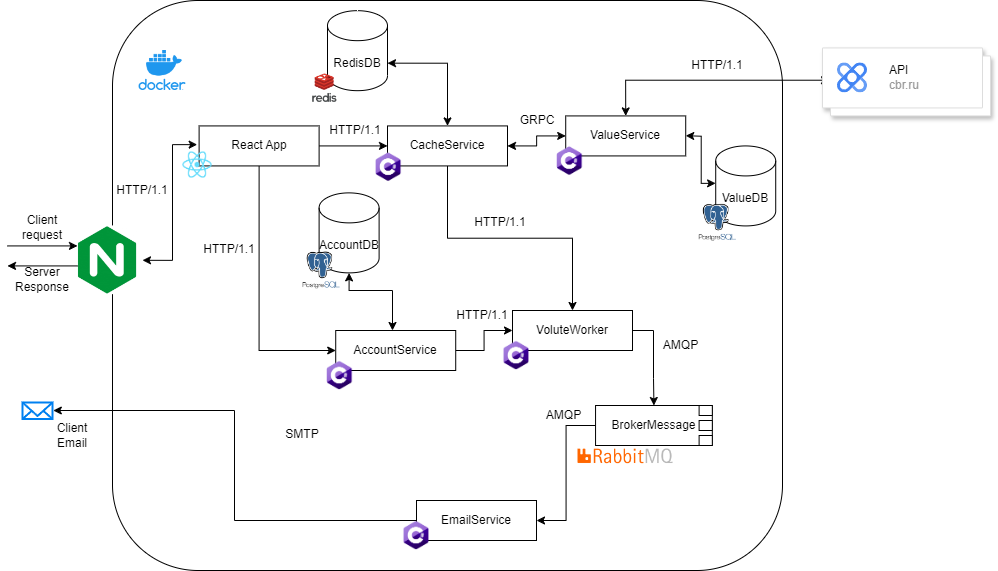

# Мониторинг курсов валют

Разработанное решение позволяет получать, сохранять и наглядко отображать данные о курсах валютах.

---

## Установка

У вас должны быть установлены [зависимости проекта](#dependency)

1. Клонирования репозитория `git clone https://github.com/Kovshik387/Exchange-Currency-DSR`

2. Запуск docker контейнеров  `docker compose up -d` 

3. Откройте `http://localhost` в вашем браузере

---

## Используемые технологии

### Backend

- [C#.NET, ASP.NET Core](https://dotnet.microsoft.com/ru-ru/apps/aspnet)
- [Nginx](https://nginx.org/ru/)
- [Docker](https://www.docker.com/), [Docker Compose](https://docs.docker.com/compose/install/linux/)
- [PostgreSQL](https://www.postgresql.org/)
- [Redis](https://redis.io/)
- [RabbitMQ](https://www.rabbitmq.com/)

### Frontend

- [React](https://ru.legacy.reactjs.org/)
- [TypeScript](https://www.typescriptlang.org/)
- [Vite](https://vitejs.dev/)

---

## Архитектура приложения

- **ValueService** - получение данных о валютах с cbr.ru
- **CacheService** - кеширование данных с `ValueService`
- **AccountService** - аутентификация и авторизация пользователя
- **VoluteWorker** - служба обновления курсов валют
- **EmailService** - отправка писем котировок пользователям
- **ReactApp** - пользовательский интерфейс
- **RabbitMQ** - брокер сообщений
- **Nginx** - прокси сервер
- **PostgreSQL** - база данных пользователей и валют

## <a id="dependency"> Зависимости проекта</a>
Для запуска проекта необходим `docker compose` версии более `1.27.0`

---

### Связь
+ Telegram: [@yrulewet](https://t.me/yrulewet)